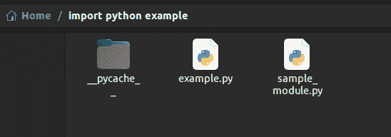

# 将 Python 文件导入 Python 中的程序

> 原文：<https://www.pythonforbeginners.com/basics/import-python-file-into-a-program-in-python>

在 python 中，我们通过导入不同的内置库来执行大部分任务。在这篇文章中，我们将讨论如何将一个 python 文件导入到一个 python 程序中。

## 从当前工作目录导入文件

我们可以使用任何文件作为模块来导入代码。为此，我们将使用 import 语句。例如，假设我们在当前工作目录中有以下名为`sample_module.py`的文件。


<noscript></noscript>

sample_module.py 中的代码如下。

```
def print_module_name():
	print("Hi, I am in the sample module file.")
```

为了导入 sample_module.py 定义的函数，我们可以使用下面的语句简单地导入 sample_module.py。

```
import sample_module
```

在这里，您可以观察到我们在 import 语句中只写了文件名，而没有写文件扩展名。导入文件后，您可以使用 python 文件中定义的函数，如下所示。

```
import sample_module

print("I am in example file. Calling functions from imported file.")
sample_module.print_module_name()
```

输出:

```
I am in example file. Calling functions from imported file.
Hi, I am in the sample module file.
```

## 将文件从不同的目录导入 Python 程序

任何 python 程序都可以直接从某些目录导入模块。这些目录在文件路径中定义。要查看这些目录，我们可以使用 sys 模块。sys 模块中的 path 属性包含当前 python 程序可以从中导入其他模块的所有目录的名称。您可以使用如下所示的`sys.path`属性打印所有这样的目录。

```
import sys
print(sys.path)
```

输出:

```
['/home/aditya1117/import python example', '/usr/lib/python310.zip', '/usr/lib/python3.10', '/usr/lib/python3.10/lib-dynload', '/home/aditya1117/.local/lib/python3.10/site-packages', '/usr/local/lib/python3.10/dist-packages', '/usr/lib/python3/dist-packages', '/usr/lib/python3.10/dist-packages']
```

如果任何目录的文件路径出现在`sys.path`属性中，我们可以将模块从该目录直接导入到我们的 python 文件中。您可以看到当前的工作目录 `"import python example"`出现在`sys.path`列表中。这就是我们能够将 sample_module 文件直接导入程序的原因。

因此，要从另一个目录导入文件，我们首先必须将该目录的文件路径添加到`sys.path`属性中。我们知道`sys.path`属性包含一个文件路径列表，我们可以使用`append()`方法将目录的文件路径附加到 [python 列表](https://avidpython.com/python-basics/python-list/)中。在将目录的文件路径添加到`sys.path`属性之后，我们可以将目录中定义的 python 文件导入到我们当前的 python 程序中。

您可以在下面的示例中观察到这一点。

```
import sys
print("Hi, I am in example file.")
print(sys.path)
sys.path.append("/home/aditya1117/codes")
print("New file paths:")
print(sys.path)
import sample

sample.module_name_printer()
```

输出:

```
Hi, I am in example file.
['/home/aditya1117/import python example', '/usr/lib/python310.zip', '/usr/lib/python3.10', '/usr/lib/python3.10/lib-dynload', '/home/aditya1117/.local/lib/python3.10/site-packages', '/usr/local/lib/python3.10/dist-packages', '/usr/lib/python3/dist-packages', '/usr/lib/python3.10/dist-packages']
New file paths:
['/home/aditya1117/import python example', '/usr/lib/python310.zip', '/usr/lib/python3.10', '/usr/lib/python3.10/lib-dynload', '/home/aditya1117/.local/lib/python3.10/site-packages', '/usr/local/lib/python3.10/dist-packages', '/usr/lib/python3/dist-packages', '/usr/lib/python3.10/dist-packages', '/home/aditya1117/codes']
Hi, I am in sample.py file in \codes directory.
```

## 结论

在本文中，我们讨论了如何将 python 文件导入 python 程序。要了解更多关于 python 编程的知识，可以阅读这篇关于 python 中的[文件处理的文章。你可能也会喜欢这篇关于用 python](https://www.pythonforbeginners.com/files/reading-and-writing-files-in-python) 理解[列表的文章。](https://www.pythonforbeginners.com/basics/list-comprehensions-in-python)